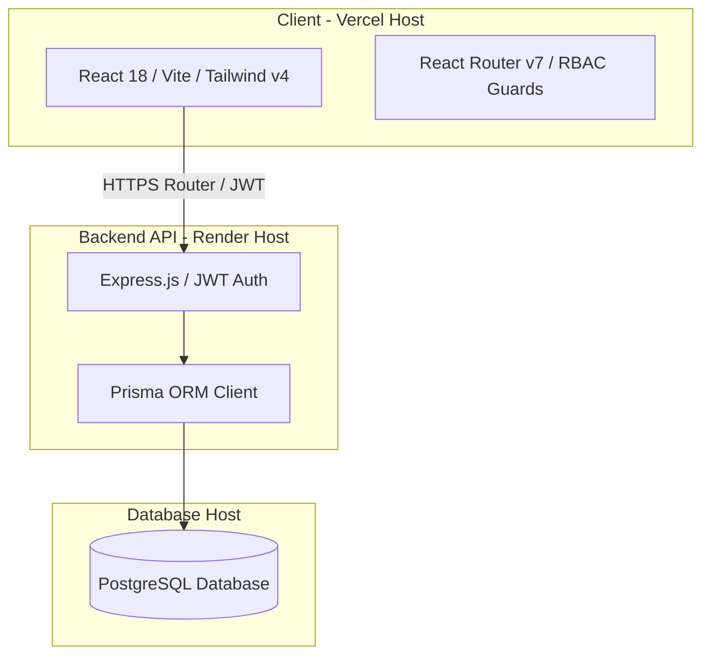

# 🏢 AI Realty Platform

Welcome to the **AI Realty Platform**—a premium, next-generation real estate discovery and brokerage portal. The application connects homebuyers directly with verified subagents through a controlled, audit-compliant communication gateway, backed by interactive AI-driven search assistance.

This repository is structured as a TypeScript monorepo, pairing a high-performance **React + Vite** frontend at the root with a robust, schema-backed **Express + Prisma + PostgreSQL** backend under the `server` directory.

---

## 🎨 System Architecture



---

## 🚀 Persona-Based Dashboards & Key Features

The platform implements Role-Based Access Control (RBAC) to present three fully distinct workflows:

### 1. 👤 Customer Portal
*   **Dynamic Property Map Discovery:** Browse listing cards synchronized with geolocation details, pricing, and visual sliders.
*   **Saved Properties List:** Keep track of preferred properties in real-time, watching for status changes or price updates.
*   **AI Real Estate Copilot:** Interact with a natural language AI chatbot that translates natural queries into property search recommendations.
*   **Direct Subagent Messenger:** Start secure chats with listing agents. All conversations are stored in a unified chat portal.

### 2. 💼 Subagent (Realtor) Portal
*   **Inventory Management:** Create, publish, update, and delete/archive property listings.
*   **Address Auto-Geocoding:** Input street addresses, which automatically retrieve latitude and longitude parameters for map placements.
*   **Verification (KYC) Submissions:** Submit licensing credentials, regions, and professional files for verification checks.
*   **Lead Pipeline:** Track customer inquiries and open direct text lines with prospects.
*   **Profile Control:** Edit contact info and update passwords.

### 3. 🛡️ Admin Portal
*   **Listing Moderation Queue:** Audit and approve or reject new listings before they are displayed publicly.
*   **Subagent Onboarding Center:** Review submitted KYC documents and verify realtor profiles.
*   **System-Wide Lead Monitor:** Audit all active inquiries, noting which properties and agents receive the most traction.
*   **Compliance Audit Logger:** Review transcripts of all customer-subagent and customer-AI chat interactions.

---

## 🛠️ Technology Stack

| Layer | Technology | Description |
| :--- | :--- | :--- |
| **Frontend Core** | React 18 & React Router v7 | Single-page architecture with nested layouts and routing guards |
| **Styles & Icons** | Tailwind CSS v4 & Lucide | Modern design system, fluid utility classes, and high-DPI icons |
| **Animations** | Framer Motion | Smooth state transitions, hover effects, and premium micro-interactions |
| **Backend API** | Node.js, Express & TypeScript | JWT-authenticated RESTful API with structured routes |
| **ORM & Database**| Prisma & PostgreSQL | Secure database queries, type-safe models, and migrations |

---

## 📁 Project Directory Layout

```text
├── server/                     # Backend API & Database
│   ├── prisma/                 # Prisma Schema & Database Migrations
│   ├── src/
│   │   ├── routes/             # Express API Route Handlers
│   │   ├── middlewares/        # JWT Authentication & RBAC Guards
│   │   ├── db.ts               # Prisma Client Initializer
│   │   ├── seed.ts             # Database Seeding Script
│   │   └── index.ts            # Express Entrypoint
│   ├── tsconfig.json
│   └── package.json
│
├── src/                        # Frontend Application
│   ├── app/
│   │   ├── components/         # Reusable UI Primitives (Button, Card, Badge, etc.)
│   │   ├── layouts/            # Dashboard Skeletons & Sidebar Menus
│   │   ├── pages/              # Portal Pages (Customer, Subagent, Admin)
│   │   └── routes.tsx          # Client-Side Application Routes
│   ├── assets/                 # Attributions, Logo Marks & SVGs
│   ├── styles/                 # Global Styles & Theme Settings
│   └── main.tsx
│
├── vercel.json                 # Vercel SPA Routing & Proxy Settings
├── vite.config.ts              # Vite Asset Resolvers, Aliases & Proxies
└── package.json                # Frontend Workspace Dependencies
```

---

## 🌐 Production Deployment Configuration

The application is configured to build and deploy dynamically on git push:

1.  **Frontend (Vercel):** The root folder is configured via [vercel.json](file:///d:/immo/ai-realty/vercel.json) to handle routing (rewriting all requests back to `/index.html` for React Router) and to proxy any `/api/*` request directly to the Render hosted backend instance (`https://ai-realty-platform.onrender.com/api`).
2.  **Backend (Render):** The `server/` directory runs on Render, connecting to a hosted PostgreSQL instance. Environment variables like `DATABASE_URL` and `JWT_SECRET` must be set up in the Render dashboard.

---

## 📝 Setup and Local Development

For step-by-step instructions on setting up your local PostgreSQL database, configuring your variables, running database seeds, and starting the servers, please refer to the [Setup Guide](file:///d:/immo/ai-realty/SETUP.md).